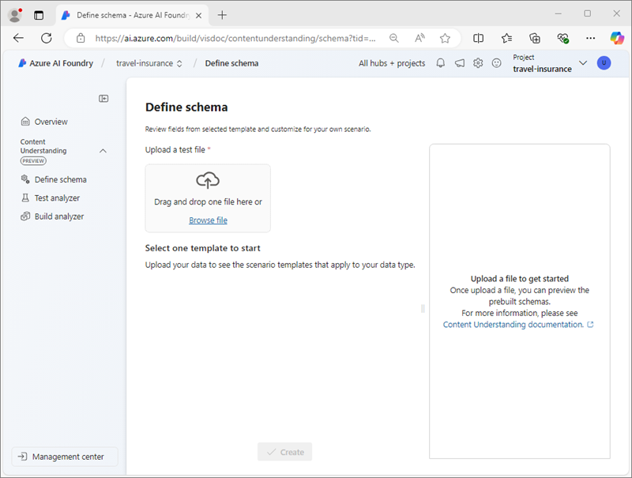
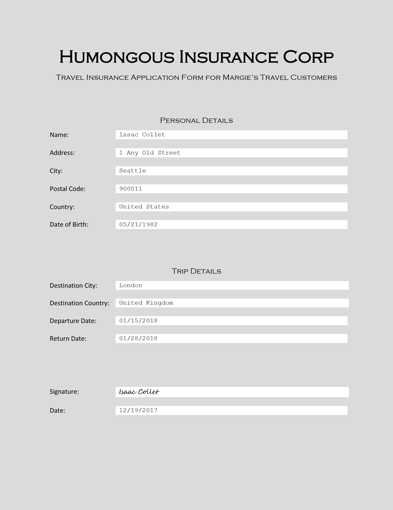

---
lab:
  title: "Analisar conteúdo com\_a Compreensão de Conteúdo da IA do Azure"
  module: Multimodal analysis with Content Understanding
---

# Analisar conteúdo com a Compreensão de Conteúdo da IA do Azure

Neste exercício, você usará o portal da Fábrica de IA do Azure para criar um projeto de compreensão de conteúdo que pode extrair informações de formulários de apólice de seguro de viagem. Em seguida, você testará seu analisador de conteúdo no Portal da Fábrica de IA do Azure e o consumirá por meio da interface REST de compreensão de conteúdo.

Este exercício levará aproximadamente **30** minutos.

## Criar um projeto de Compreensão de conteúdo

Vamos começar usando o Portal da Fábrica de IA do Azure para criar um projeto de Compreensão de Conteúdo.

1. Em um navegador da Web, abra o [Portal da Fábrica de IA do Azure](https://ai.azure.com) em `https://ai.azure.com` e entre usando suas credenciais do Azure.

    A página inicial do Azure AI Foundry é semelhante à seguinte imagem:

    

1. Na seção **Localizar rapidamente** da home page, na parte inferior, selecione **Compreensão de Conteúdo**.
1. Na página **Compreensão de conteúdo**, clique no botão **Criar novo projeto de compreensão de conteúdo**.
1. Na etapa **Visão geral do projeto**, defina as seguintes propriedades para o seu projeto e selecione **Avançar**:
    - **Nome do projeto**: `travel-insurance`
    - **Descrição**: `Insurance policy data extraction`
    - **Hub**: Criar um novo hub
1. Na etapa **Criar um hub**, defina as seguintes propriedades e selecione **Avançar**:
    - **Recurso do Hub de IA do Azure**: `content-understanding-hub`
    - **Assinatura do Azure**: *Selecione sua assinatura do Azure*
    - **Grupo de recursos**: *crie um novo grupo de recursos com um nome apropriado*
    - **Localização**: *Selecione qualquer local disponível*
    - **Serviços de IA do Azure**: *crie um novo recurso de serviços de IA do Azure com um nome apropriado*
1. Na etapa **Configurações de armazenamento**, especifique uma nova conta de armazenamento do Hub de IA e selecione **Avançar**.
1. Na página **Revisar**, selecione **Criar projeto**. Aguarde a criação do projeto e seus recursos relacionados.

    Quando o projeto estiver pronto, ele abrirá na página **Definir esquema**.

    

## Revisar os recurso do Azure

Quando você criou o Hub de IA e o projeto, vários recursos foram criados em sua assinatura do Azure para dar suporte ao projeto.

1. Em uma guia do navegador, abra o [portal do Azure](https://portal.azure.com) em `https://portal.azure.com` e entre usando suas credenciais do Azure.
1. Navegue até o grupo de recursos criado para o hub e observe os recursos do Azure que foram criados.

    

## Definir um esquema personalizado

Você vai construir um analisador que pode extrair informações de formulários de seguro de viagem. Você começará definindo um esquema com base em um formulário de exemplo.

1. Baixe o formulário de amostra [train-form.pdf](https://github.com/microsoftlearning/mslearn-ai-document-intelligence/raw/main/Labfiles/05-content-understanding/forms/train-form.pdf) em `https://github.com/microsoftlearning/mslearn-ai-document-intelligence/raw/main/Labfiles/05-content-understanding/forms/train-form.pdf` e salve-o em uma pasta local.
1. Retorne à guia do navegador que contém o projeto de Compreensão de conteúdo e, na página **Definir esquema**, faça o upload do arquivo **train-form.pdf** que você acabou de baixar.
1. Selecione o modelo **Análise de documento** e, em seguida, selecione **Criar**.

    O editor de esquema fornece uma maneira de definir os campos de dados a serem extraídos do formulário, que é mostrado à direita. O formulário é assim:

    

    Os campos de dados no formulário consistem em:
    
    - Uma coleção de dados pessoais relacionados ao segurado.
    - Uma coleção de detalhes relacionados à viagem para a qual o seguro é necessário.
    - Uma assinatura e data

    Começaremos adicionando um campo que representa os detalhes pessoais como uma tabela, na qual definiremos subcampos para os detalhes individuais.

1. Selecione **+Adicionar novo campo** para criar um novo campo com os seguintes valores:
    - **Nome do campo:**: `PersonalDetails`
    - **Descrição do campo**: `Policyholder information`
    - **Tipo de valor**: tabela
1. Selecione **Salvar alterações** (&#10004;) e observe que um novo subcampo é criado automaticamente.
1. Configure o novo subcampo com os seguintes valores:
    - **Nome do campo**: `PolicyholderName`
    - **Descrição do campo**: `Policyholder name`
    - **Tipo de valor**: Cadeia de caracteres
    - **Método**: Extrair
1. Use o botão **+ Adicionar novo subcampo** para adicionar os seguintes subcampos adicionais:

    | Nome do campo | Descrição do campo | Tipo de valor | Método |
    |--|--|--|--|
    | `StreetAddress` | `Policyholder address` | String | Extração |
    | `City` | `Policyholder city` | String | Extração |
    | `PostalCode` | `Policyholder post code` | String | Extração |
    | `CountryRegion` | `Policyholder country or region` | String | Extração |
    | `DateOfBirth` | `Policyholder birth date` | Data | Extração |

1. Depois de adicionar todos os subcampos de detalhes pessoais, use o botão **Voltar** para retornar ao nível superior do esquema.
1. Adicione um novo campo *tabela* nomeado **`TripDetails`** para representar os detalhes da viagem segurada. Em seguida, adicione os seguintes subcampos:

    | Nome do campo | Descrição do campo | Tipo de valor | Método |
    |--|--|--|--|
    | `DestinationCity` | `Trip city` | String | Extração |
    | `DestinationCountry` | `Trip country or region` | String | Extração |
    | `DepartureDate` | `Date of departure` | Data | Extração |
    | `ReturnDate` | `Date of return` | Data | Extração |

1. Retorne ao nível superior do esquema e adicione os dois campos individuais a seguir:

    | Nome do campo | Descrição do campo | Tipo de valor | Método |
    |--|--|--|--|
    | `Signature` | `Policyholder signature` | String | Extração |
    | `Date` | `Date of signature` | Data | Extração |

1. Verifique se o esquema concluído tem esta aparência e salve-o.

    

1. Na página **Analisador de Teste**, se a análise não começar automaticamente, selecione **Executar análise**. Em seguida, aguarde a conclusão da análise e revise os valores de texto no formulário identificados como correspondentes aos campos no esquema.

    

    O serviço de Compreensão de Conteúdo deve ter identificado corretamente o texto que corresponde aos campos no esquema. Se não tiver feito isso, você poderá usar a página **Dados do rótulo** para fazer upload de outro formulário de exemplo e identificar explicitamente o texto correto para cada campo.

## Criar e testar um analisador

Agora que você treinou um modelo para extrair campos de formulários de seguro, pode criar um analisador para usar com formulários semelhantes.

1. No painel de navegação à esquerda, selecione a página **Criar analisador**.
1. Selecione **+ Criar analisador** e crie um novo analisador com as seguintes propriedades (digitadas exatamente como mostrado aqui):
    - **Nome**: `travel-insurance-analyzer`
    - **Descrição**: `Insurance form analyzer`
1. Aguarde até que o novo analisador esteja pronto (use o botão **Atualizar** para verificar).
1. Baixe [test-form.pdf](https://github.com/microsoftlearning/mslearn-ai-document-intelligence/raw/main/Labfiles/05-content-understanding/forms/test-form.pdf) em `https://github.com/microsoftlearning/mslearn-ai-document-intelligence/raw/main/Labfiles/05-content-understanding/forms/test-form.pdf` e salve-o em uma pasta local.
1. Retorne à página **Criar analisador** e clique no link **travel-insurance-analyzer**. Os campos definidos no esquema do analisador serão exibidos.
1. Na página **travel-insurance-analyzer**, selecione **Testar**.
1. Use o botão **+ Carregar arquivos de teste** para carregar **test-form.pdf** e executar a análise para extrair dados de campo do formulário de teste.

    

1. Exiba a guia **Resultado** para ver os resultados formatados em JSON retornados pelo analisador. Na próxima tarefa, você usará a API REST de Compreensão de Conteúdo para enviar um formulário ao analisador e retornar os resultados nesse formato.
1. Feche a página **travel-insurance-analyzer**.

## Use a API REST de compreensão de conteúdo

Agora que você criou um analisador, pode consumi-lo em um aplicativo cliente por meio da API REST de Compreensão de conteúdo.

1. Alterne para a guia do navegador que contém o portal do Azure (ou abra `https://portal.azure.com` em uma nova guia se você a tiver fechado).
1. No grupo de recursos do hub de Compreensão de conteúdo, abra o recurso **Serviços de IA do Azure**.
1. Na página **Visão geral**, na seção **Chaves e ponto de extremidade**, exiba a guia **Compreensão de conteúdo**.

    

    Você precisará do ponto de extremidade de Compreensão de conteúdo e de uma das chaves para se conectar ao analisador em um aplicativo cliente.

1. Use o botão **[\>_]** à direita da barra de pesquisa na parte superior da página para criar um Cloud Shell no portal do Azure selecionando um ambiente do ***PowerShell***. O Cloud Shell fornece uma interface de linha de comando em um painel na parte inferior do portal do Azure, conforme mostrado aqui:

    

    > **Observação**: se você já criou um Cloud Shell que usa um ambiente *Bash*, alterne-o para o ***PowerShell***.

1. Você pode redimensionar o Cloud Shell arrastando a barra de separação na parte superior do painel ou usando os ícones **&#8212;**, **&#10530;** e **X** no canto superior direito do painel para minimizar, maximizar e fechar o painel. Para obter mais informações de como usar o Azure Cloud Shell, confira a [documentação do Azure Cloud Shell](https://docs.microsoft.com/azure/cloud-shell/overview).
1. Na barra de ferramentas do Cloud Shell, no menu **Configurações**, selecione **Ir para a versão clássica** (isso é necessário para usar o editor de código).

1. No painel do PowerShell, insira os seguintes comandos para clonar o repositório GitHub para este exercício:

    ```
    rm -r mslearn-ai-doc -f
    git clone https://github.com/microsoftlearning/mslearn-ai-document-intelligence mslearn-ai-doc
    ```

1. Depois que o repositório for clonado, navegue até a pasta **mslearn-ai-doc/Labfiles/05-content-understanding/code** :

    ```
    cd mslearn-ai-doc/Labfiles/05-content-understanding/code
    ```

1. Insira o seguinte comando para editar o arquivo de código Python **analyze_doc.py** que foi fornecido:

    ```
    code analyze_doc.py
    ```
    O arquivo de código Python é aberto em um editor de código:

    

1. No arquivo de código, substitua o espaço reservado **\<CONTENT_UNDERSTANDING_ENDPOINT\>** pelo ponto de extremidade de Compreensão de conteúdo e o espaço reservado **\<CONTENT_UNDERSTANDING_KEY\>** por uma das chaves para o recurso serviços de IA do Azure.

    > **Dica**: você precisará redimensionar ou minimizar a janela do Cloud Shell para copiar o ponto de extremidade e a chave na página do recurso serviços de IA do Azure no portal do Azure – tenha cuidado para não *fechar* o Cloud Shell (ou você precisará repetir as etapas acima)

1. Depois de substituir os espaços reservados, use o comando **CTRL+S** para salvar as alterações e revise o código concluído, que:
    - Envia uma solicitação HTTP POST para o ponto de extremidade de Compreensão de conteúdo, instruindo o **travel-insurance-analyzer** a analisar um formulário com base na URL.
    - Verifica a resposta da operação POST para recuperar uma ID para a operação de análise.
    - Envia repetidamente uma solicitação HTTP GET para o serviço de Compreensão de conteúdo até que a operação não esteja mais em execução.
    - Se a operação tiver sido bem-sucedida, exibirá a resposta JSON.
1. Use o comando **CTRL+Q** para fechar o editor de código enquanto mantém a linha de comando do Cloud Shell aberta.
1. No painel de linha de comando do Cloud Shell, insira o seguinte comando para instalar a biblioteca de **solicitações** do Python (que é usada no código):

    ```
    pip install requests
    ```

1. Depois que a biblioteca for instalada, no painel de linha de comando do Cloud Shell, insira o seguinte comando para executar o código Python:

    ```
    python analyze_doc.py
    ```

1. Revise a saída do programa, que inclui os resultados JSON da análise do documento.

    > **Dica**: o buffer de tela no console do Cloud Shell pode não ser grande o suficiente para mostrar toda a saída. Se você quiser revisar toda a saída, execute o programa usando o comando `python analyze_doc.py > output.txt`. Em seguida, quando o programa terminar, use o comando `code output.txt` para abrir a saída em um editor de código.

## Limpar

Se tiver terminado de usar o serviço Compreensão de conteúdo, deverá excluir os recursos que criou neste exercício para evitar incorrer em custos desnecessários do Azure.

1. No Portal da Fábrica de IA do Azure, navegue até o projeto **travel-insurance** e exclua-o.
1. No portal do Azure, exclua o grupo de recursos criado para este exercício.

